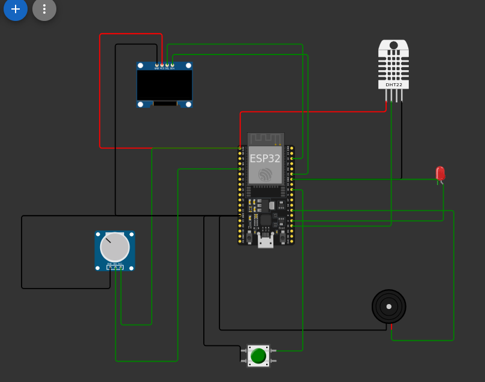

# Smart Sensor Monitor using ESP32 + FreeRTOS (Wokwi Simulation)

A real-time embedded system built on ESP32 using FreeRTOS to simulate an IoT smart monitoring device. The system demonstrates multitasking, inter-task communication, and real-time decision-making using sensor data.

---

## Project Overview

This project simulates a smart embedded monitoring system capable of:

- Reading environmental data (temperature & humidity)
- Monitoring simulated load/current
- Triggering real-time alerts (LED + buzzer)
- Displaying system status (optional OLED)
- Simulating cloud communication

The system is designed using **FreeRTOS task-based architecture**, making it scalable and production-oriented.

---

## Hardware (Simulated in Wokwi)

- ESP32 DevKit V1
- DHT22 Temperature & Humidity Sensor
- Potentiometer (simulated load sensor)
- LED (alarm indicator)
- Buzzer (alert system)
- SSD1306 OLED Display (optional UI)

---

## RTOS Architecture

The system is divided into 3 independent real-time tasks:

### 🔹 SensorTask (High Priority)
- Reads DHT22 sensor
- Reads analog load value
- Sends structured data to queue

### 🔹 AlertTask (Medium Priority)
- Receives sensor data from queue
- Checks threshold conditions
- Activates LED and buzzer if needed

### 🔹 CloudTask (Low Priority)
- Simulates IoT cloud data transmission
- Runs independently without blocking system

---

## RTOS Communication Model

The system uses:

- **Queue** → Safe communication between tasks
- **Task Priorities** → Deterministic scheduling
- **Non-blocking delays** → Real-time responsiveness

```text id="q9m8lx"
SensorTask  → Queue → AlertTask
                     → CloudTask

```
---

### Key Features

- FreeRTOS multitasking architecture
- Producer–consumer model using queues
- Real-time sensor monitoring
- Threshold-based alert system
- Modular embedded design
- ESP32 IoT-ready structure

---

### Technologies Used

- ESP32 (Arduino framework)
- FreeRTOS (built-in)
- C/C++
- Wokwi Simulator
- DHT sensor library

---

### System Behavior

Condition	           Action
Temp > 30°C	         LED + Buzzer ON
Load > threshold	ALERT triggered
Normal state	     System idle

---

### How to Run

1- Open Wokwi project
2- Load ESP32 simulation
3- Upload main.cpp
4- Start simulation
5- Open Serial Monitor

---

### Architecture



### Author

Morched Ammar
Embedded Systems & IoT Engineer
ESP32 | STM32 | FreeRTOS | IoT Systems